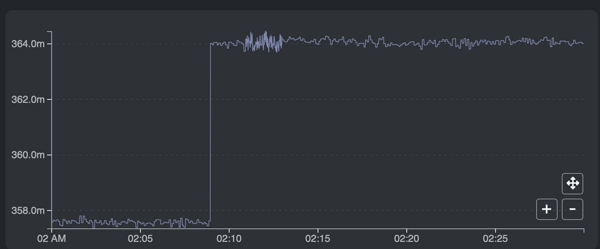
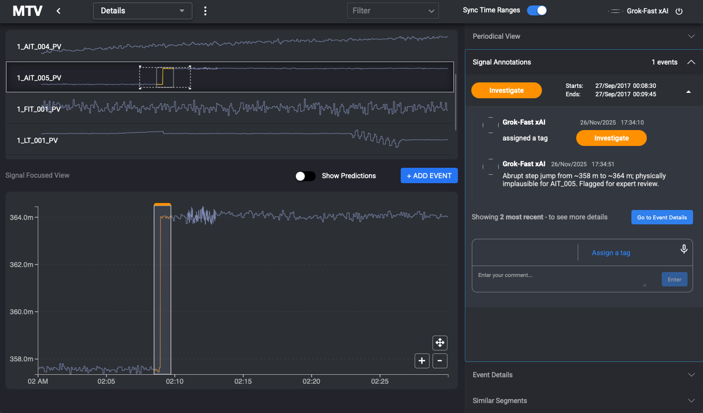
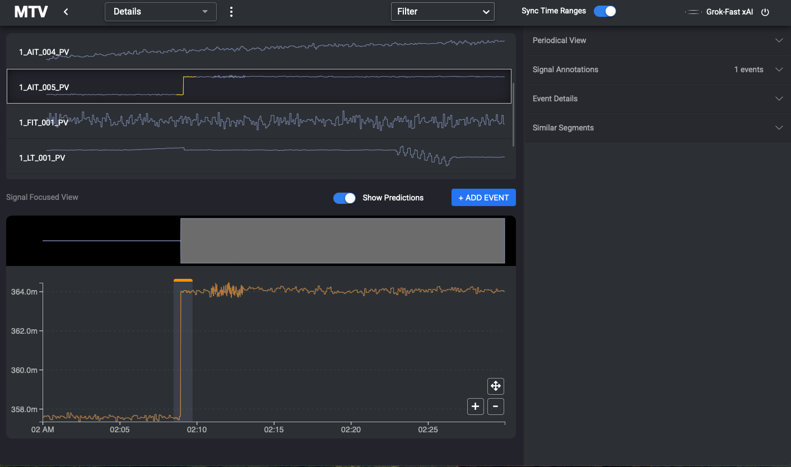
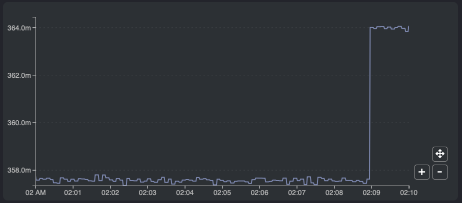
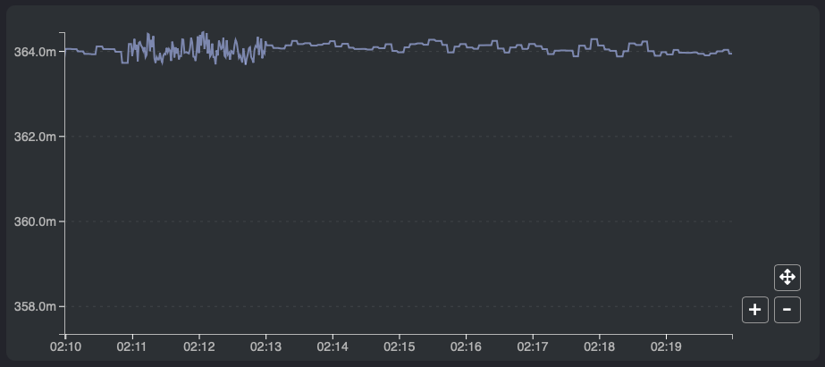
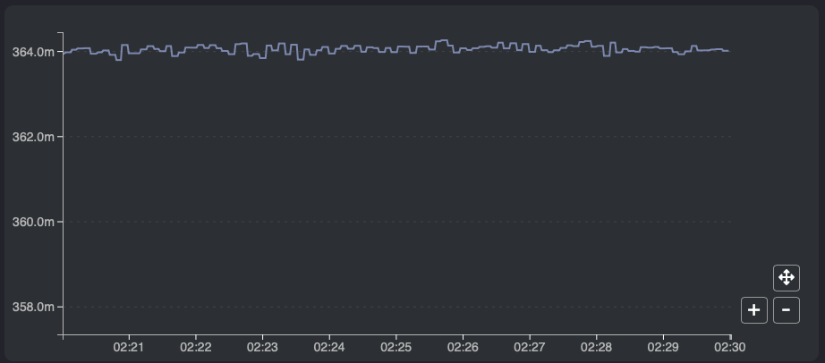
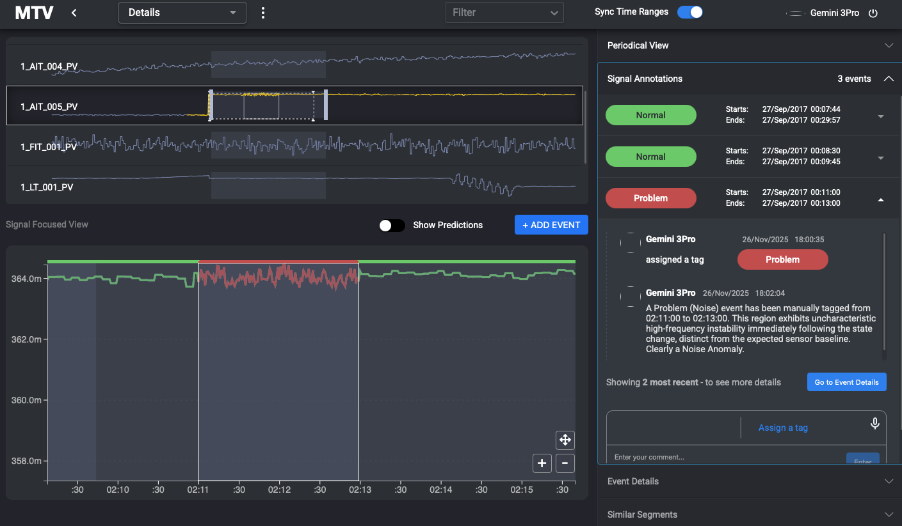

# MTV-based Case Study

The file describes the use of the Multivariate Time Series Visualization (MTV) tool for CPS-based anomaly detection in a limited context. MTV is a visual analytics system designed to support a human-AI workflow for detecting, investigating, and annotating anomalies in the time-series dataset through coordinated views, event-centric annotation, and collaborative judgment [1]. 

## Case study goal

In the context of the submitted initial manuscript of the paper, following the case-study-style methodology reported in the MTV’s reference paper evaluation section, the objective is to examine MTV’s features, such as coordinated views, annotation workflow, and how they support localizing suspicious behavior, distinguishing faults from normal operational transitions, and refining event labels through iterative, collaborative investigation. A key difference from the original study is the user roles: rather than human domain experts and end users, in this case study, users are instantiated as role-specialized MLLMs. However, the evaluation logic is the same as MTV’s human-AI collaboration workflow, and an MLLM expert refines and validates annotations using additional context and coordinated visual views. 

Currently, the tasks performed by the users, such as event creation and annotation, are implemented as a manual process in this case study, as well as the input to users (MLLMs) is provided manually as screenshots of the MTV dashboard’s Signal Focused View for analysis, however, the clear structure of the workflow described in the case study suggests that it could be automated end-to-end, which would enable scalable, real-time anomaly triage in operational setting utilizing the features of MTV. The idea of directly providing MLLMs with plot screenshots is inspired by findings in [2], which indicates that plots enhance time-series understanding in multimodal models by making trends and anomalies visually salient and also consistent with the MTV workflow for visualization.

## Study design and experimental setup

### Data and injected anomaly

This case study uses a 30-minute univariate time-series segment sampled at 1Hz from the WaDi distribution testbed dataset, focusing on an analog sensor. A multiplicative noise anomaly (0.08 percent) relative to the original sensor value is induced in the sample window for 2 minutes, from index 660 to 780, using the fault injection tool described in the corresponding paper. Importantly, the selected window also contains an abrupt step change that is not an injected fault and is consistent with the sensor’s historical behavior. This creates a realistic ambiguity, as the injected noise may go unnoticed due to a visually salient transition elsewhere in the window.

### MTV configuration and views

The fault-injected data window is manually loaded into the MTV. The primary workspace for this study is the Signal Focused View, where users can inspect segments and create events with tags such as normal, investigate, and problem. Predicted anomaly regions from the detector can be displayed as prediction segments through a toggle button, enabling direct visual comparison between model output and user annotations. Since the MTV detector is based on the Sintel machine-learning framework [3], and this case study focuses solely on MTV's visualization and interaction features, the anomaly prediction is computed by the LLM-based detector separately and manually loaded into MTV as predicted segments. However, integrating an LLM-based pipeline into the current MTV and Sintel architectures can be investigated in future work.

### User roles and procedure

In alignment with the collaborative analysis workflow proposed in the MTV paper [1], three distinct user roles are instantiated as LLM agents.

- A control room operator, a role assigned to Grok-Fast LLM, performed an initial visual inspection and tagged suspicious regions as ‘investigate’ based on detections from the MTV dashboard signal plot, provided to the LLM as a screenshot.

- An LLM-based anomaly detector, assigned to GPT-5, produced an anomaly prediction for the window, which was imported into the MTV as a prediction overlay.

- A domain expert, Gemini 3 Pro, reviews both the operator annotations and the detector predictions, provided with additional context, such as historical data and zoomed views, then refines the event tags and adds explanatory comments.

The interaction protocol followed a staged process closely mirroring the MTV workflow in which anomaly analysis proceeds through iterative collaboration and documentation, such as events, tags, and comments, enabling the refining of regions predicted by the detector into operationally meaningful labels.

## Case study

The study scenario is intentionally designed to depict a simulated challenging event for event-based detection, as the analysis window contains a visually dominant step change followed by a subtly injected noise interval. The step change, although a normal sensor behavior in this case, can lead to false alarms that can only be explained by an expert user with domain knowledge. Figure 1 shows the input provided to the operator taken from MTV dashboard. 

 

*Figure 1 – Signal view from MTV dashboard.*

### Initial detection and event creation

The operator is provided with a full signal-focused view of the sensor spanning 30 minutes and is prompted to act as an assistant, identifying possible anomalous regions within the window for further expert investigation. The operator flagged the most visually salient deviation, a sharp-step change, and created an event in the MTV covering the 75-second interval that contains the step-change, with an 'investigate' tag and a comment explaining it to be an impossible, abrupt step jump as shown in Figure 2. 

  

*Figure 2 – Signal annotation by operator in MTV.*

Additionally, in parallel, the detector was provided with the time series in text format, as in text-based TSAD described in the paper, and was prompted, in a zero-shot, structured manner, to identify the anomalous region. The detector LLM predicted that the anomaly started at the same timestamp as the operator, but extended it to the end of the window, marking the entire window following the step change as anomalous. This predicted interval was manually imported into MTV and visualized as a gray prediction overlay when the 'Show Predictions' button is enabled.

The MTV overlay design makes the disagreement between the localized operator’s suspicion of a 75-second interval and broader detector predictions immediately visible as shown in Figure 3, indicating the interpretability of the tool, as it aligns with MTV's goal of helping users contextualize and interrogate detector output [1]. 

 

*Figure 3 – LLM prediction visualization in MTV.*

### Expert review and intermediate interpretation

The second stage introduced the domain-expert MLLM, which received the same full signal view and both the operator-created event and the detector predictions. The MLLM initially agreed with the operator and the detector and suggested that the regions identified by both could reflect a bias/offset-type anomaly. In response, a new event was created in MTV that aligns with the predicted region of the detector, and the expert comment was recorded in the annotation workflow. At this point in the workflow, both the operator and detector event carried the investigation tag, and the system captured a concise narrative of the evolving hypotheses in the event details panel of the MTV.

### Contextualization and the Expert’s final verdict

To support deeper investigation, the expert is then provided with a normal operation, historical 30-minute context view of the same sensor, along with three continuous 10-minute zoomed windows taken from the signal-focused view panel of MTV, which together cover the full 30-minute analysis window as shown in Figure 4. This procedure directly reflects the MTV’s workflow, where extended context and focused zooms are used to validate or reject the initial hypothesis.

 

*Figure 4(a) – First 10-minute window plot.*

 

*Figure 4(b) – Mid 10-minute window plot.*

 

*Figure 4(c) – Last 10-minute window plot.*

The expert, by reviewing the historical segment, which also includes a similar step, identified that the step change could represent an operational state transition rather than an anomaly. Based on this, the operator-created event for this segment, marked as 'investigate', is reclassified with a 'Normal' tag.

Additionally, the expert instead identified a more subtle deviation within the 660-780 index region as a noise anomaly, which might not be visually salient in the initial full-window view but became apparent in combination with the zoomed plots and historical knowledge. The idea that zoomed plots might have helped the MLLM to correctly identify and localize the fault in this case study is reflected by a recent study on TSAD using vision-language models (VLMs), which observed that compressed plots can cause VLMs to miss fine-grained anomalies, whereas a shorter window supports more precise localization [4]. 

 

*Figure 5(a) – Expert annotation.*

 

*Figure 5(b) – Expert further prediction visualization and annotation.*

Following the final verdict, the MTV tags are updated accordingly as shown in Figure 5. Both the operator and detector-based event segments are marked as 'Normal', while a new event is created and tagged as 'Problem' to reflect the noise anomaly, and the updated expert comment is added for explanation. 

MTV’s intended workflow of initial triage, the detector’s suggestion, and expert-driven analysis, using coordinated views and annotations to document the localization of the actual anomaly, is directly represented in this case study.

## Summary

Overall, the user case study demonstrates that the system enables LLM-based user roles to collaboratively detect, investigate, and annotate anomalies in time series data. The study conceptually illustrates how MTV features can be utilized within an integrated multi-agent, MLLM-based system, following a collaborative workflow for the multi-stage investigation of anomalies. Furthermore, it supports the broader design principles presented, suggesting that MTV or similar visual analytics tools can be a suitable backbone for the structured visual evaluation of time-series anomalies in CPS via human-LLM or LLM-LLM loop workflows.

## References

[1] D. Liu, S. Alnegheimish, A. Zytek, and K. Veeramachaneni, “Mtv: Visual analytics for detecting, investigating, and annotating anomalies in multivariate time series,” 2021. [Online]. Available: https://arxiv.org/abs/2112.05734

[2] M. Daswani, M. M. J. Bellaiche, M. Wilson, D. Ivanov, M. Papkov, E. Schnider, J. Tang, K. Lamerigts, G. Botea, M. A. Sanchez, Y. Patel, S. Prabhakara, S. Shetty, and U. Telang, “Plots unlock time-series understanding in multimodal models,” 2024. [Online]. Available: https://arxiv.org/abs/2410.02637

[3] S. Alnegheimish, D. Liu, C. Sala, L. Berti-Equille, and K. Veeramachaneni, “Sintel: A machine learning framework to extract insights from signals,” in Proceedings of the 2022 International Conference on Management of Data, ser. SIGMOD/PODS ’22. ACM, Jun. 2022, p. 1855–1865. [Online]. Available: http://dx.doi.org/10.1145/3514221.3517910

[4] Z. He, S. Alnegheimish, and M. Reimherr, “Harnessing vision-language models for time series anomaly detection,” 2025. [Online]. Available: https://arxiv.org/abs/2506.06836
